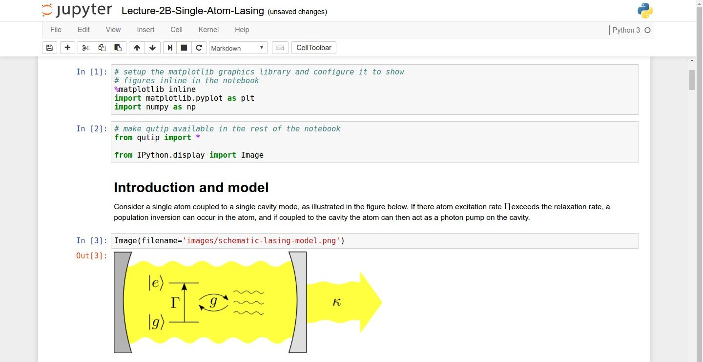
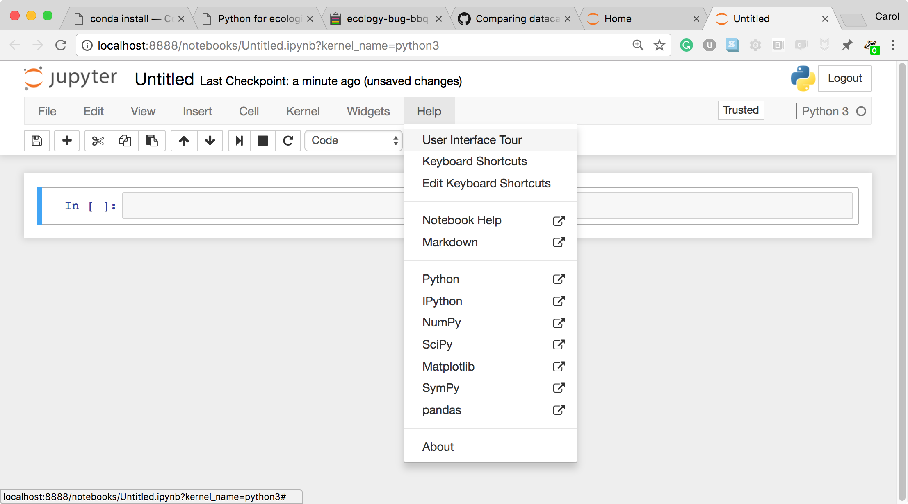
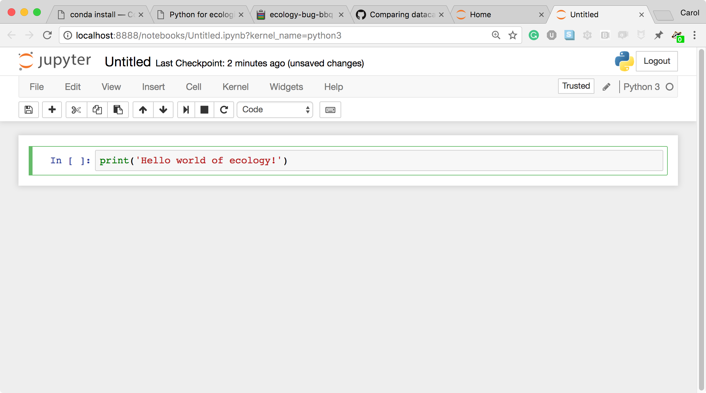

{alt='Example Jupyter Notebook'}
*Captura de pantalla de un [Jupyter Notebook sobre mecánica cuántica](https://github.com/jrjohansson/qutip-lectures) por Robert Johansson*

### Como funcionan los **Jupyter notebooks**

Al escribir el comando `jupyter notebook`, ocurre lo siguiente:

- Un servidor de **Jupyter Notebook** es creado en tu máquina local.

- El servidor de  **Jupyter Notebook** solo se ejecuta en tu máquina local
  y no utiliza una conexión a internet.

- El servidor de **Jupyter Notebook** abre el cliente de **Jupyter Notebook**,
  también conocido como la interfaz de usuario de notebook, en tu navegador web
  predeterminado.
  
  {alt='Navegador de archivos de Jupyter notebook'}
  *El navegador de archivos de **Jupyter notebook***

- Para crear un nuevo **notebook** de Python selecciona **"New"** del manu
  desplegable de la esquina superior derecha de la pantalla.
  
  {alt='Navegador de archivos de Jupyter notebook'}
  *El navegador de archivos de **Jupyter notebook***

- Cuando creas un nuevo **notebook** y escribes código en tu navegador, el
  navegador web y el servidor de **Jupyter Notebook** se comunican entre si.
  
  {alt='nuevo Jupyter notebook'}
  *Un nuevo **Jupyter notebook** en blanco*

- Bajo el menu **"help"**, puedes tomar un rápido tour interactivo sobre como
  utilizar el **notebook**. Más ayuda sobre **Jupyter** y recursos de
  paquetes clave se encuentran aquí también.
  
  {alt='ayuda y tour Jupyter'}
  *Tour de interfaz del usuario y Ayuda*

- El servidor de **Jupyter Notebook** hace el trabajo y los cálculos, y el navegador
  web procesa el **notebook**.

- El navegador web entonces te muestra el **notebook** actualizado.

- Por ejemplo, haz clic en la primera celda y escribe algo de código en Python.
  
  {alt='celda de código'}
  *Una celda de código*

- Esta es una celda de **Código** (nota el tipo de celda en el menú desplegable con la palabra **Code**).
  Para ejecutar la celda, presiona <kbd>Shift</kbd>\+<kbd>Return</kbd>.
  
  {alt='Una celda de código y su resultado'}
  *Una celda de código y su resultado*

- Veamos una celda de **Markdown**. **Markdown** es un lenguaje de manipulación de
  texto que es legible pero que ofrece formato adicional. No olvides
  seleccionar **Markdown** del menú desplegable de tipo de celda. Haz clic
  en la celda y escribe texto en **Markdown**.
  
  {alt='Una celda de Markdown'}
  *Una celda de **Markdown***

- Para ejecutar una celda, presiona <kbd>Shift</kbd>\+<kbd>Return</kbd>.
  
  {alt='rendered markdown cell'}
  *Una celda de **Markdown** ejecutada*

Este flujo de trabajo tiene varias ventajas:

- Puedes escribir, editar, copiar y pegar bloques de código fácilmente.
- El autocompletado facilita el accesso a los nombres de las cosas que estas usando
  y te permite aprender más de ellas.
- Te permite anotar tu código con enlaces, texto de diferentes tamaños,
  viñetas, etc. para hacer la información más accesible para ti y tus
  colaboradores.
- Te permite mostrar gráficos junto al código que los produce para contar
  la historia completa de tu análisis.

### Como se guarda el **notebook**

- El archivo **notebook** se guarda en un formato llamado JSON y tiene el
  sufijo `.ipynb`.
- Igual que HTML para una página web, lo que se guarda en un archivo **notebook**
  se ve diferente a lo que tu vez en tu navegador.
- Pero este formato le permite a **Jupyter** mezclar software (en muchos lenguajes)
  con documentación y gráficos, todo en un archivo.

### Modos del **Notebook**: **Control** y **Edit**

El **notebook** tiene dos modos de operación: **Control** y **Edit**. El modo
**Control** te permite editar funciones a nivel **notebook**; mientras, el modo
**Edit** te permite cambiar los contenidos de las celdas del **notebook**.
Recuerda que un **notebook** esta compuesto de un número de celdas que contienen
código, **markdown**, html, visualizaciones, y más.

### Ayuda y más información

Utiliza el menú **Help** y sus opciones **options** cuando lo necesites.

